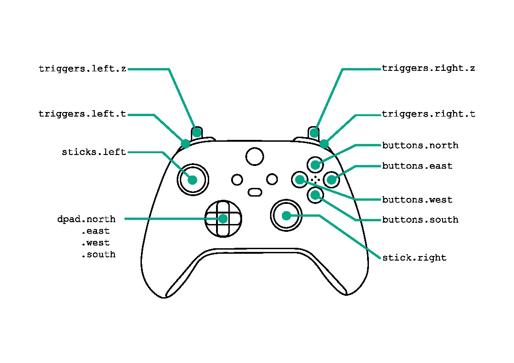

# Sofa.GamepadController
This module allows you to handle gamepad events in your SOFA scene.

</img>

## Usage
There are two important classes for users: `GamepadSofaController` and `GamepadCallbacks`

`GamepadSofaController` needs to be fed a `GamepadCallbacks` object that implements callbacks for the events that you are interested into.

For example, if you just want to react to a clicked `A` button on a Xbox controller

```python
def a_button_callback():
        print("You clicked A button!")

callbacks = GamepadCallbacks()
callbacks.buttons.clicked.south = a_button_callback

# Adds the controller to thhe SOFA scene
rootnode.addObject(GamepadSofaController(callbacks=callbacks))
```

**Important**: The callbacks have a typed signature, check the docstring. You can use captured variables to modify objects inside the callback.

**Note**: On Windows, if you want to use Dualshock 4 controllers, install [DS4Windows](https://ds4-windows.com/get-started/). This emulates XBox controllers and make the gamepad compatible with Windows 10+.
